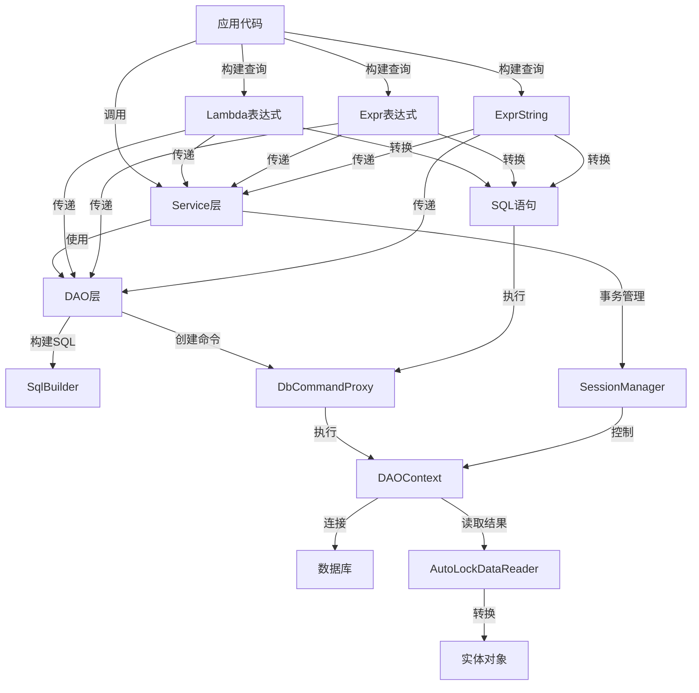

# LiteOrm 项目代码Wiki

## 1. 仓库概览

LiteOrm 是一个轻量级、高性能的 .NET ORM（对象关系映射）框架，结合了微ORM的速度和全ORM的人体工程学设计。它适用于需要可预测性能同时仍能干净处理丰富SQL场景的项目。

**主要功能/亮点：**
- 超高性能：性能接近原生Dapper，远超EF Core
- 多数据库支持：原生支持SQL Server、MySQL、Oracle、PostgreSQL、SQLite
- 灵活查询：通过Lambda、`Expr`或`ExprString`多种查询方法
- 自动关联：通过属性实现JOIN查询，无需手动编写SQL
- 声明式事务：通过`[Transaction]`属性实现AOP事务管理
- 动态分表：通过`IArged`接口实现表路由
- 异步支持：完整的async/await支持
- 类型安全：强类型泛型接口，具有编译时类型检查

**典型应用场景：**
- 需要高性能数据访问的企业应用
- 多数据库环境的项目
- 复杂查询需求的系统
- 需要分表策略的大数据量应用
- 追求代码简洁性和可维护性的项目

## 2. 目录结构

LiteOrm 项目采用模块化设计，清晰地分离了核心功能、公共组件、示例和测试代码。项目结构组织合理，便于维护和扩展。

```text
├── LiteOrm/                # 核心库
│   ├── Classes/            # 核心类
│   ├── CodeGen/            # 代码生成
│   ├── Converter/          # 转换器
│   ├── DAO/                # 数据访问对象
│   ├── DAOContext/         # 数据访问上下文
│   ├── DbAccess/           # 数据库访问
│   ├── Initilizer/         # 初始化器
│   ├── Service/            # 服务层
│   └── SqlBuilder/         # SQL构建器
├── LiteOrm.Common/         # 公共组件
│   ├── Attributes/         # 特性
│   ├── Classes/            # 公共类
│   ├── Converter/          # 公共转换器
│   ├── Expr/               # 表达式
│   ├── MetaData/           # 元数据
│   ├── Model/              # 模型
│   ├── Service/            # 公共服务
│   ├── SqlBuilder/         # 公共SQL构建器
│   └── SqlSegment/         # SQL片段
├── LiteOrm.Demo/           # 示例项目
│   ├── DAO/                # 示例DAO
│   ├── Data/               # 示例数据
│   ├── Demos/              # 示例代码
│   ├── Models/             # 示例模型
│   └── Services/           # 示例服务
├── LiteOrm.Tests/          # 测试项目
│   ├── Attributes/         # 特性测试
│   ├── Classes/            # 类测试
│   ├── Converter/          # 转换器测试
│   ├── Expr/               # 表达式测试
│   ├── Infrastructure/     # 测试基础设施
│   ├── MetaData/           # 元数据测试
│   ├── Models/             # 测试模型
│   └── Service/            # 服务测试
├── LiteOrm.Benchmark/      # 性能基准测试
└── docs/                   # 文档
    ├── 01-getting-started/ # 入门指南
    ├── 02-core-usage/      # 核心使用
    ├── 03-advanced-topics/ # 高级主题
    ├── 04-extensibility/   # 扩展性
    └── 05-reference/       # 参考
```

**核心模块职责：**

| 模块 | 主要职责 | 文件位置 | <mcfile>引用 |
|-----|---------|---------|------------|
| DAO | 数据访问操作 | LiteOrm/DAO/ | <mcfile name="DAO" path="/workspace/LiteOrm/DAO/" /> |
| Service | 业务服务 | LiteOrm/Service/ | <mcfile name="Service" path="/workspace/LiteOrm/Service/" /> |
| SqlBuilder | SQL语句构建 | LiteOrm/SqlBuilder/ | <mcfile name="SqlBuilder" path="/workspace/LiteOrm/SqlBuilder/" /> |
| Expr | 查询表达式 | LiteOrm.Common/Expr/ | <mcfile name="Expr" path="/workspace/LiteOrm.Common/Expr/" /> |
| Attributes | 实体映射特性 | LiteOrm.Common/Attributes/ | <mcfile name="Attributes" path="/workspace/LiteOrm.Common/Attributes/" /> |
| MetaData | 元数据管理 | LiteOrm.Common/MetaData/ | <mcfile name="MetaData" path="/workspace/LiteOrm.Common/MetaData/" /> |

## 3. 系统架构与主流程

LiteOrm 采用分层架构设计，清晰地分离了数据访问、业务逻辑和表示层。系统架构遵循依赖倒置原则，通过接口实现各层之间的解耦。

### 核心架构组件

1. **实体层**：定义数据模型，通过特性映射到数据库表
2. **DAO层**：提供基础数据访问操作，处理CRUD操作
3. **服务层**：封装业务逻辑，提供高级操作和事务支持
4. **表达式系统**：提供强大的查询构建能力
5. **SQL构建器**：针对不同数据库生成优化的SQL语句
6. **上下文管理**：处理数据库连接和会话

### 数据流向与主流程



**主要流程说明：**

1. **初始化流程**：
   - 应用启动时，通过`RegisterLiteOrm()`注册服务
   - 扫描实体类型，构建元数据
   - 初始化数据库连接池和会话管理

2. **数据访问流程**：
   - 应用代码调用Service层方法
   - Service层使用DAO执行具体操作
   - DAO创建DbCommandProxy命令对象
   - 通过DAOContext执行命令
   - 使用AutoLockDataReader读取结果
   - 结果转换为实体对象返回

3. **查询流程**：
   - 通过Lambda表达式、Expr或ExprString构建查询条件
   - 表达式可以直接传递给Service层或DAO层
   - 表达式转换为SQL语句
   - 创建DbCommandProxy执行查询
   - 使用AutoLockDataReader读取结果
   - 结果转换为实体对象返回

4. **事务流程**：
   - 通过`[Transaction]`属性标记需要事务的方法
   - SessionManager管理事务上下文
   - 多个操作在同一事务中执行

5. **命令执行流程**：
   - DAO创建DbCommandProxy对象
   - 设置命令文本和参数
   - 通过DAOContext执行命令
   - 使用AutoLockDataReader安全读取结果
   - 自动处理资源释放

## 4. 核心功能模块

### 4.1 数据访问对象 (DAO)

DAO层是LiteOrm的核心，提供了直接的数据访问操作。它包括多个实现类，针对不同的数据访问场景。

**主要组件：**

- **DAOBase**：所有DAO的抽象基类，提供通用操作
- **ObjectDAO**：对象化数据访问，处理实体对象的CRUD
- **DataDAO**：数据化访问，返回DataTable等数据结构
- **ObjectViewDAO**：处理视图对象的访问
- **DataViewDAO**：处理数据视图的访问
- **DbCommandProxy**：数据库命令代理，封装了IDbCommand，提供参数处理和执行功能
- **AutoLockDataReader**：自动锁定的数据读取器，确保数据读取过程中的线程安全

**核心功能：**
- 实体对象的增删改查
- 批量操作支持
- 表达式查询
- 分表支持
- 异步操作
- 命令执行与参数处理
- 安全的数据读取

### 4.2 服务层 (Service)

Service层封装了业务逻辑，提供了更高级的操作接口。它基于DAO层构建，增加了事务管理和业务规则。

**主要组件：**

- **EntityService**：实体服务，提供完整的CRUD操作
- **EntityViewService**：视图服务，专注于查询操作

**核心功能：**
- 完整的CRUD操作
- 批量操作
- 事务支持
- 异步方法
- 表达式查询

### 4.3 表达式系统 (Expr)

表达式系统是LiteOrm的特色功能，提供了强大的查询构建能力。它支持三种查询方式：Lambda表达式、Expr对象和ExprString。

**主要组件：**

- **Expr**：表达式基类
- **LogicExpr**：逻辑表达式
- **ValueExpr**：值表达式
- **SelectExpr**：选择表达式
- **UpdateExpr**：更新表达式
- **DeleteExpr**：删除表达式

**核心功能：**
- 构建复杂查询条件
- 支持各种运算符
- 支持子查询
- 支持JOIN操作
- 类型安全

### 4.4 SQL构建器 (SqlBuilder)

SQL构建器负责根据表达式生成针对不同数据库的优化SQL语句。它支持多种数据库类型，提供了数据库特定的语法和函数支持。

**主要组件：**

- **SqlBuilder**：SQL构建器基类
- **SqlServerBuilder**：SQL Server专用构建器
- **MySqlBuilder**：MySQL专用构建器
- **OracleBuilder**：Oracle专用构建器
- **PostgreSqlBuilder**：PostgreSQL专用构建器
- **SQLiteBuilder**：SQLite专用构建器

**核心功能：**
- 生成数据库特定的SQL语句
- 处理参数化查询
- 支持分页
- 支持函数调用
- 处理数据库特定的语法

### 4.5 元数据管理 (MetaData)

元数据管理负责处理实体类型与数据库表之间的映射关系。它通过特性系统构建元数据，为DAO和SQL构建器提供必要的信息。

**主要组件：**

- **TableInfoProvider**：表信息提供者
- **SqlTable**：表信息
- **SqlColumn**：列信息
- **TableDefinition**：表定义
- **ColumnDefinition**：列定义

**核心功能：**
- 构建实体类型的元数据
- 处理表和列的映射
- 管理主键和外键关系
- 支持分表配置

### 4.6 事务管理

LiteOrm提供了声明式事务管理，通过`[Transaction]`属性标记需要事务的方法。事务管理由SessionManager负责，确保多个操作在同一事务中执行。

**核心功能：**
- 声明式事务
- 事务嵌套
- 事务回滚
- 异步事务支持

## 5. 核心 API/类/函数

### 5.1 数据访问核心 API

#### DAOBase

**功能**：所有DAO的抽象基类，提供通用操作方法

**主要方法**：
- `NewCommand()`：创建数据库命令
- `MakeNamedParamCommand()`：创建带参数的命令
- `MakeExprCommand()`：根据表达式创建命令
- `GetValue<T>()`：执行查询并返回单个值
- `Execute()`：执行非查询SQL
- `Query<TResult>()`：执行查询并返回结果集

**使用场景**：作为DAO的基类，提供通用功能

<mcfile name="DAOBase.cs" path="/workspace/LiteOrm/DAO/DAOBase.cs" />

#### ObjectDAO<T>

**功能**：处理实体对象的CRUD操作

**主要方法**：
- `Insert()`：插入实体
- `Update()`：更新实体
- `Delete()`：删除实体
- `DeleteByKeys()`：根据主键删除
- `Search()`：查询实体
- `BatchInsert()`：批量插入
- `BatchUpdate()`：批量更新
- `BatchDelete()`：批量删除

**使用场景**：直接操作实体对象，执行CRUD操作

<mcfile name="ObjectDAO.cs" path="/workspace/LiteOrm/DAO/ObjectDAO.cs" />

#### DbCommandProxy

**功能**：数据库命令代理，封装了IDbCommand，提供参数处理和执行功能

**主要方法**：
- `CreateParameter()`：创建数据库参数
- `ExecuteNonQuery()`：执行非查询命令
- `ExecuteReader()`：执行查询并返回数据读取器
- `ExecuteScalar()`：执行查询并返回单个值

**使用场景**：封装数据库命令，处理参数和执行操作

<mcfile name="DbCommandProxy.cs" path="/workspace/LiteOrm/DbAccess/DbCommandProxy.cs" />

#### AutoLockDataReader

**功能**：自动锁定的数据读取器，确保数据读取过程中的线程安全

**主要方法**：
- `Read()`：读取下一条记录
- `GetValue()`：获取指定列的值
- `GetInt32()/GetString()/等`：获取指定类型的值
- `Dispose()`：释放资源

**使用场景**：安全地读取数据库查询结果

<mcfile name="AutoLockDataReader.cs" path="/workspace/LiteOrm/DbAccess/AutoLockDataReader.cs" />

### 5.2 服务层核心 API

#### EntityService<T, TView>

**功能**：提供实体的完整业务操作

**主要方法**：
- `Insert()`：插入实体
- `Update()`：更新实体
- `Delete()`：删除实体
- `BatchInsert()`：批量插入
- `BatchUpdate()`：批量更新
- `BatchDelete()`：批量删除
- `Search()`：查询实体
- `SearchOne()`：查询单个实体
- `SearchAsync()`：异步查询

**使用场景**：在业务逻辑层使用，提供完整的实体操作

<mcfile name="EntityService.cs" path="/workspace/LiteOrm/Service/EntityService.cs" />

#### EntityViewService<TView>

**功能**：专注于查询操作的服务

**主要方法**：
- `Search()`：查询实体
- `SearchOne()`：查询单个实体
- `SearchAsync()`：异步查询
- `Count()`：统计记录数

**使用场景**：仅需要查询功能的场景

<mcfile name="EntityViewService.cs" path="/workspace/LiteOrm/Service/EntityViewService.cs" />

### 5.3 表达式系统核心 API

#### Expr

**功能**：表达式基类，提供查询构建能力

**主要方法**：
- `Prop()`：创建属性表达式
- `Exists<T>()`：创建存在性子查询
- `From<T>()`：创建从表开始的查询
- `ToPreparedSql()`：转换为预处理SQL

**使用场景**：构建复杂的查询条件

<mcfile name="Expr.cs" path="/workspace/LiteOrm.Common/Expr/Expr.cs" />

#### LogicExpr

**功能**：逻辑表达式，用于构建WHERE条件

**主要操作符**：
- `&`：AND操作
- `|`：OR操作
- `!`：NOT操作

**使用场景**：构建复杂的逻辑条件

<mcfile name="LogicExpr.cs" path="/workspace/LiteOrm.Common/Expr/LogicExpr.cs" />

### 5.4 SQL构建器核心 API

#### SqlBuilder

**功能**：SQL构建器基类，提供SQL生成功能

**主要方法**：
- `ToSqlName()`：转换为SQL名称
- `ToSqlParam()`：转换为SQL参数
- `ConvertToDbValue()`：转换为数据库值
- `ConvertFromDbValue()`：从数据库值转换
- `BuildSelect()`：构建SELECT语句
- `BuildInsert()`：构建INSERT语句
- `BuildUpdate()`：构建UPDATE语句
- `BuildDelete()`：构建DELETE语句

**使用场景**：生成数据库特定的SQL语句

<mcfile name="SqlBuilder.cs" path="/workspace/LiteOrm/SqlBuilder/SqlBuilder.cs" />

### 5.5 元数据核心 API

#### SqlTable

**功能**：表示数据库表的元数据

**主要属性**：
- `Name`：表名
- `Columns`：列集合
- `Keys`：主键列
- `Definition`：表定义

**使用场景**：提供表的元数据信息

<mcfile name="SqlTable.cs" path="/workspace/LiteOrm.Common/MetaData/SqlTable.cs" />

#### TableInfoProvider

**功能**：提供表信息的提供者

**主要方法**：
- `GetTable()`：获取表信息
- `GetColumn()`：获取列信息

**使用场景**：构建和管理表的元数据

<mcfile name="TableInfoProvider.cs" path="/workspace/LiteOrm.Common/MetaData/TableInfoProvider.cs" />

## 6. 技术栈与依赖

| 技术/依赖 | 版本 | 用途 | 来源 |
|----------|------|-----|------|
| .NET | 8.0+ | 运行环境 | <mcfile name="LiteOrm.csproj" path="/workspace/LiteOrm/LiteOrm.csproj" /> |
| .NET Standard | 2.0+ | 跨平台支持 | <mcfile name="LiteOrm.csproj" path="/workspace/LiteOrm/LiteOrm.csproj" /> |
| Autofac | 10.0.0 | 依赖注入 | <mcfile name="LiteOrm.csproj" path="/workspace/LiteOrm/LiteOrm.csproj" /> |
| Autofac.Extensions.DependencyInjection | 10.0.0 | 依赖注入扩展 | <mcfile name="LiteOrm.csproj" path="/workspace/LiteOrm/LiteOrm.csproj" /> |
| Autofac.Extras.DynamicProxy | 7.1.0 | 动态代理 | <mcfile name="LiteOrm.csproj" path="/workspace/LiteOrm/LiteOrm.csproj" /> |
| Castle.Core | 5.2.1 | 动态代理核心 | <mcfile name="LiteOrm.csproj" path="/workspace/LiteOrm/LiteOrm.csproj" /> |
| Castle.Core.AsyncInterceptor | 2.1.0 | 异步拦截器 | <mcfile name="LiteOrm.csproj" path="/workspace/LiteOrm/LiteOrm.csproj" /> |
| Microsoft.Extensions.Hosting.Abstractions | 10.0.5 | 主机抽象 | <mcfile name="LiteOrm.csproj" path="/workspace/LiteOrm/LiteOrm.csproj" /> |
| Microsoft.Extensions.Logging.Abstractions | 10.0.5 | 日志抽象 | <mcfile name="LiteOrm.csproj" path="/workspace/LiteOrm/LiteOrm.csproj" /> |
| System.Text.Json | 10.0.5 | JSON处理 | <mcfile name="LiteOrm.Common.csproj" path="/workspace/LiteOrm.Common/LiteOrm.Common.csproj" /> |

**数据库支持：**
- SQL Server 2012+
- Oracle 12c+
- PostgreSQL
- MySQL
- SQLite

## 7. 关键模块与典型用例

### 7.1 实体定义与映射

**功能说明**：通过特性定义实体与数据库表的映射关系

**配置与依赖**：
- 引用LiteOrm.Common命名空间
- 使用Table和Column特性

**示例代码**：

```csharp
using LiteOrm.Common;

[Table("Users")]
public class User
{
    [Column("Id", IsPrimaryKey = true, IsIdentity = true)]
    public int Id { get; set; }

    [Column("UserName")]
    public string UserName { get; set; }

    [Column("Email")]
    public string Email { get; set; }

    [Column("CreateTime")]
    public DateTime? CreateTime { get; set; }
}
```

### 7.2 服务定义与使用

**功能说明**：定义和使用实体服务，提供完整的CRUD操作

**配置与依赖**：
- 定义服务接口和实现
- 通过依赖注入获取服务实例

**示例代码**：

```csharp
// 定义视图模型（用于查询，可以包含相关字段）
public class UserView : User { }

public interface IUserService :
    IEntityService<User>, IEntityServiceAsync<User>,
    IEntityViewService<UserView>, IEntityViewServiceAsync<UserView>
{
}

public class UserService : EntityService<User, UserView>, IUserService
{
}

// 使用服务
var user = new User { UserName = "admin", Email = "admin@test.com" };
await userService.InsertAsync(user);

var users = await userService.SearchAsync(u => u.Email.Contains("test"));
var admin = await userService.SearchOneAsync(u => u.UserName == "admin");

user.Email = "newemail@test.com";
await userService.UpdateAsync(user);

await userService.DeleteAsync(user);
```

### 7.3 查询方法

**功能说明**：使用不同的查询方法构建和执行查询

**配置与依赖**：
- 了解三种查询方式：Lambda、Expr、ExprString

**示例代码**：

```csharp
// Lambda查询
var users = await userService.SearchAsync(u => u.Age > 18);

// 排序
var sorted = await userService.SearchAsync(
    q => q.Where(u => u.Age > 18).OrderBy(u => u.Age)
);

// 分页
var paged = await userService.SearchAsync(
    q => q.Where(u => u.Status == 1)
          .OrderBy(u => u.Id)
          .Skip(10).Take(20)
);

// Expr查询
var expr = Expr.Prop("Age") > 18 & Expr.Prop("Status") == 1;
var users = await userService.SearchAsync(expr);

// IN查询
var users = await userService.SearchAsync(
    Expr.Prop("Id").In(1, 2, 3, 4, 5)
);

// LIKE查询
var users = await userService.SearchAsync(
    Expr.Prop("UserName").Contains("admin")
);

// ExprString查询
int minAge = 18;
var expr = Expr.Prop("Age") > 25;
var users = await objectViewDAO.Search($"WHERE {expr} AND Age > {minAge}").ToListAsync();
```

### 7.4 自动关联

**功能说明**：通过属性定义实现自动JOIN查询

**配置与依赖**：
- 使用ForeignType和ForeignColumn特性

**示例代码**：

```csharp
// 定义关联
[Table("Orders")]
public class Order
{
    [Column("Id", IsPrimaryKey = true)]
    public int Id { get; set; }

    [Column("UserId")]
    [ForeignType(typeof(User))]
    public int UserId { get; set; }
}

// 视图模型，包含关联字段
public class OrderView : Order
{
    [ForeignColumn(typeof(User), Property = "UserName")]
    public string UserName { get; set; }
}

// 自动JOIN查询
var orders = await orderService.SearchAsync<OrderView>();
```

### 7.5 声明式事务

**功能说明**：通过特性标记实现事务管理

**配置与依赖**：
- 使用Transaction特性

**示例代码**：

```csharp
public class BusinessService
{
    private readonly IUserService userService;
    private readonly IOrderService orderService;

    [Transaction]
    public async Task CreateUserWithOrder(User user, Order order)
    {
        await userService.InsertAsync(user);
        order.UserId = user.Id;
        await orderService.InsertAsync(order);
    }
}
```

### 7.6 动态分表

**功能说明**：通过IArged接口实现表路由

**配置与依赖**：
- 实现IArged接口

**示例代码**：

```csharp
public class Log : IArged
{
    [Column("Id", IsPrimaryKey = true)]
    public int Id { get; set; }

    [Column("Content")]
    public string Content { get; set; }

    [Column("CreateTime")]
    public DateTime CreateTime { get; set; }

    // 自动路由到Log_202401, Log_202402等表
    string[] IArged.TableArgs => [CreateTime.ToString("yyyyMM")];
}
```

## 8. 配置、部署与开发

### 8.1 配置

LiteOrm通过appsettings.json配置数据库连接：

```json
{
    "LiteOrm": {
        "Default": "DefaultConnection",
        "DataSources": [
            {
                "Name": "DefaultConnection",
                "ConnectionString": "Server=localhost;Database=TestDb;...",
                "Provider": "MySqlConnector.MySqlConnection, MySqlConnector"
            }
        ]
    }
}
```

### 8.2 注册与初始化

**Console应用**：

```csharp
var host = Host.CreateDefaultBuilder(args)
    .RegisterLiteOrm()  // 自动初始化
    .Build();
```

**ASP.NET Core应用**：

```csharp
var builder = WebApplication.CreateBuilder(args);
builder.Host.RegisterLiteOrm();  // 通过IHostBuilder扩展方法集成
```

### 8.3 开发流程

1. **定义实体**：创建带有Table和Column特性的实体类
2. **定义服务**：创建服务接口和实现
3. **注册服务**：通过依赖注入注册服务
4. **使用服务**：在应用中使用服务执行CRUD操作
5. **编写查询**：使用Lambda、Expr或ExprString构建查询

### 8.4 性能优化

- 使用批量操作减少数据库往返
- 合理使用索引
- 优化查询条件
- 使用分表策略处理大数据量
- 启用连接池

## 9. 监控与维护

### 9.1 日志

LiteOrm集成了Microsoft.Extensions.Logging，可以通过配置日志提供程序来记录操作：

```csharp
// 在注册时配置日志
builder.Host.RegisterLiteOrm(options => {
    options.LoggerFactory = loggerFactory;
});
```

### 9.2 常见问题与排查

**连接问题**：
- 检查连接字符串是否正确
- 验证数据库服务器是否可达
- 检查数据库用户权限

**性能问题**：
- 检查查询是否优化
- 验证索引是否合理
- 考虑使用分表策略

**映射问题**：
- 确保实体属性与数据库列正确映射
- 检查主键定义
- 验证外键关系

## 10. 总结与亮点回顾

LiteOrm 是一个轻量级、高性能的 .NET ORM框架，它的设计理念是结合微ORM的速度和全ORM的便利性。通过本次分析，我们可以看到以下核心亮点：

1. **卓越的性能**：性能接近原生Dapper，远超EF Core，在插入、更新和查询操作上都有出色表现。

2. **多数据库支持**：原生支持SQL Server、MySQL、Oracle、PostgreSQL和SQLite，提供了统一的API。

3. **灵活的查询系统**：支持Lambda表达式、Expr对象和ExprString三种查询方式，满足不同场景的需求。

4. **自动关联**：通过属性定义实现自动JOIN查询，减少了手动SQL编写的工作量。

5. **声明式事务**：通过`[Transaction]`属性实现AOP事务管理，简化了事务代码。

6. **动态分表**：通过`IArged`接口实现表路由，支持大数据量场景。

7. **完整的异步支持**：提供了全面的async/await方法，支持现代异步编程模式。

8. **类型安全**：强类型泛型接口，提供编译时类型检查，减少运行时错误。

9. **模块化设计**：清晰的分层架构，便于维护和扩展。

10. **丰富的功能**：支持批量操作、子查询、窗口函数等高级特性。

LiteOrm 是一个精心设计的ORM框架，它在性能、功能和易用性之间取得了很好的平衡。无论是小型应用还是大型系统，都能从LiteOrm的设计中受益。它的高性能特性使其特别适合对性能要求较高的场景，而其丰富的功能又能满足复杂业务逻辑的需求。

通过本Wiki文档，我们对LiteOrm的架构、功能和使用方法有了全面的了解。希望这份文档能帮助开发者更好地理解和使用LiteOrm，从而构建出更高性能、更易维护的应用系统。