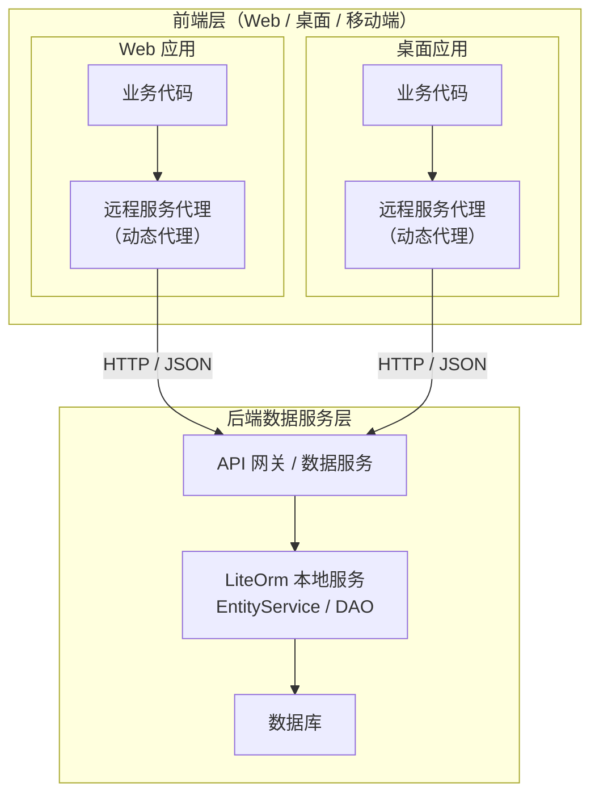
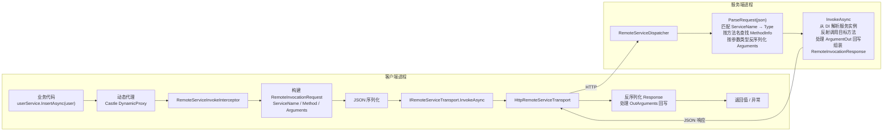
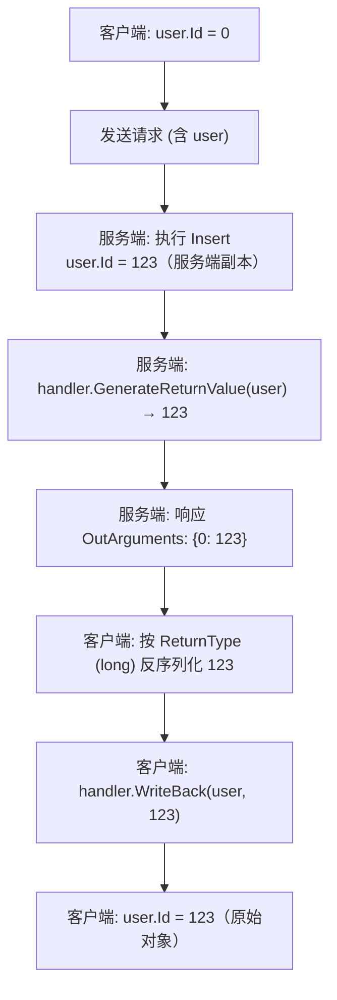

# 远程服务（LiteOrm.Remote）

LiteOrm 提供完整的远程服务调用方案，由两个独立的 NuGet 包构成：

| 包 | 角色 | 说明 |
|----|------|------|
| `LiteOrm.Remote` | 客户端 | 生成动态代理拦截方法调用，通过 HTTP 转发到服务端 |
| `LiteOrm.Remote.Server` | 服务端 | 接收 HTTP 请求，解析后从 DI 容器解析服务实例并执行 |

客户端与服务端共享 `LiteOrm.Common` 中的 DTO（`RemoteInvocationRequest` / `RemoteInvocationResponse` 等，命名空间 `LiteOrm.Remote`），保证协议一致。`ServiceName` 的生成与解析统一由 `LiteOrm.Common.TypeResolverHelper` 承担（客户端 `TypeResolverHelper.GetName` 生成，服务端 `TypeResolverHelper.FindType` 解析）。

### 前后端物理分离的意义

在传统的单体应用中，数据访问层与应用层运行在同一个进程内，数据库连接串直接暴露在配置文件中。这意味着：

- 任何能访问应用服务器的人都能触达数据库
- 前端 Web 项目与数据库紧耦合，无法独立部署和扩展
- 多端（Web、移动端、桌面端）共享同一套代码时，数据库访问逻辑无法复用

LiteOrm.Remote 通过**远程服务代理**实现了前后端的物理分离：



**核心价值：**

| 价值 | 说明 |
|------|------|
| **数据库不暴露** | 数据库连接串仅存在于后端数据服务层，前端层无法直接访问数据库 |
| **安全隔离** | 前端层只能通过受控的服务接口访问数据，所有查询经过 ExprValidator 验证 |
| **多端复用** | Web、桌面、移动端共享同一套服务接口，后端逻辑统一维护 |
| **独立部署** | 前端层和后端层可独立扩容、独立更新，互不影响 |
| **接口不变** | 业务代码无需改动——本地调用 `userService.InsertAsync(user)` 和远程调用写法完全一致 |

> **对比传统方案**：传统方案中，如果 Web 前端和桌面客户端都需要访问数据库，要么各自维护一套数据访问代码（重复且易出错），要么通过 REST API 手动封装（需额外编写 Controller 和 DTO 映射）。LiteOrm.Remote 让服务接口定义本身就成为了 API 协议，无需额外封装层。

## 架构总览



## 服务端配置

### 1. 安装包

```bash
dotnet add package LiteOrm.Remote.Server
```

### 2. 注册服务并映射端点

在 `Program.cs` / `Startup.cs` 中：

```csharp
using LiteOrm.Remote.Server;

var builder = WebApplication.CreateBuilder(args);

// 注册 LiteOrm 主框架（EntityService 等本地服务）
builder.Host.RegisterLiteOrm();

// 注册远程服务端
builder.Services.AddRemoteServer(options =>
{
    options.InvokePath = "api/remote/invoke"; // 默认值，需与客户端一致
    // 可选：指定服务/模型命名空间以提升解析速度
    // options.ServiceTypeResolver = new DefaultServiceTypeResolver("MyApp.Services", "MyApp.Models");
});

var app = builder.Build();

// 映射远程调用 HTTP 端点
app.MapRemoteInvokeEndpoint();
app.Run();
```

### 服务类型解析器

服务端通过 `IRemoteServiceTypeResolver` 将请求中的 `ServiceName`（类型短名）解析为实际服务接口类型。

| 实现 | 行为 |
|------|------|
| `DefaultServiceTypeResolver` | 默认实现。未指定命名空间时全程序集按类型短名扫描；指定 `ServiceNamespace`/`ModelNamespace` 后优先按 `命名空间.类型名` 精确匹配，失败再回退全程序集短名扫描 |
| `DelegateRemoteServiceTypeResolver` | 通过委托自定义解析逻辑 |
| 自定义实现 `IRemoteServiceTypeResolver` | 完全控制解析过程 |

`DefaultServiceTypeResolver` 构造函数接受**服务接口命名空间**和**实体模型命名空间**两个可选参数（注意：不接受 `Assembly` 参数）：

```csharp
// 默认：全程序集按类型短名扫描
options.ServiceTypeResolver = new DefaultServiceTypeResolver();

// 指定服务接口与实体模型所在的命名空间，优先精确匹配、提升解析速度并避免同名类型冲突
options.ServiceTypeResolver = new DefaultServiceTypeResolver(
    serviceNamespace: "MyApp.Services",
    modelNamespace: "MyApp.Models");

// 或使用工厂（可注入其他 DI 服务）
builder.Services.AddRemoteServer(options =>
{
    options.ServiceTypeResolverFactory = sp =>
        new DefaultServiceTypeResolver("MyApp.Services", "MyApp.Models");
});
```

> **泛型类型匹配**：`DefaultServiceTypeResolver` 查找开放泛型类型时使用 CLR 泛型名格式 `Foo`1`（baseName + "`" + arity），避免与同名的非泛型类型冲突。

### `TypeResolverHelper` —— 类型名 ↔ 类型双向解析

`DefaultServiceTypeResolver` 底层使用 `LiteOrm.Common.TypeResolverHelper` 完成 `ServiceName`（类型短名）到 `Type` 的解析。这是一个公共工具类，位于 `LiteOrm.Common` 命名空间，提供类型名与 `Type` 的双向转换，**客户端生成 `ServiceName` 和服务端解析 `ServiceName` 都依赖它**。

#### 核心方法

| 方法 | 说明 |
|------|------|
| `GetName(Type)` | 生成类型可序列化名称。非泛型返回 `Type.Name`；泛型返回 `基名<参数短名1,...>`（去除反引号 arity 后缀，递归处理嵌套泛型） |
| `FindType(string typeName, string? defaultNamespace = null)` | 按名称查找类型 |
| `Register(string name, Type type)` | 注册自定义名称 ↔ 类型映射（**优先级最高**） |
| `Unregister(string name)` | 注销自定义映射 |
| `TryParseGenericServiceName(string)` | 解析泛型服务名为 (基名, 参数名数组)，如 `IEntityService<User>` → `("IEntityService", ["User"])` |

#### `FindType` 解析顺序

1. **自定义注册**（`Register` 注册的映射，优先级最高）
2. **`Type.GetType`**（兼容程序集限定名 `AssemblyQualifiedName` 与全名）
3. **精确全名匹配**（跨程序集遍历 `assembly.GetType(typeName)`）
4. **默认命名空间 + 短名**（当 `defaultNamespace` 已设置且 `typeName` 为短名时，组合为全名精确匹配）
5. **短名扫描**（遍历所有程序集按 `Type.Name` 匹配）

> **泛型类型名**：泛型类型应使用 CLR 名称格式 `Foo`1`（含反引号 arity 后缀），避免与同名的非泛型类型冲突。

#### 使用场景：自定义服务名

默认 `ServiceName` 使用类型短名，若需自定义（如多版本共存、名称简化），通过 `TypeResolverHelper.Register` 注册：

```csharp
using LiteOrm.Common;

// 将 IUserService 映射为 "Users"（客户端和服务端都需要注册）
TypeResolverHelper.Register("Users", typeof(IUserService));

// 之后客户端生成请求时 ServiceName = "Users"
// 服务端解析 "Users" → typeof(IUserService)
```

> **重要**：`Register` 必须在客户端和服务端**两端同时调用**，确保 `ServiceName` 一致。注册后 `GetName` 返回自定义名称，`FindType` 优先返回注册类型。

### `[Service]` 特性

服务端默认扫描标记了 `[Service]` 且 `IsService == true` 的接口进行注册。未标记的接口不会暴露为远程服务。

```csharp
[Service]                                        // 暴露为远程服务
public interface IDemoUserService : IEntityServiceAsync<DemoUser>
{
}

[Service(IsService = false)]                     // 显式禁用远程调用
public interface IInternalService
{
}
```

## 客户端配置

### 1. 安装包

```bash
dotnet add package LiteOrm.Remote
```

### 2. 注册远程客户端

```csharp
using LiteOrm.Remote;

var host = Host.CreateDefaultBuilder(args)
    .RegisterLiteOrmRemote(opts =>
    {
        opts.RemoteServiceUri = new Uri("http://localhost:5000");
        opts.RemoteServicePath = "api/remote/invoke"; // 默认值，需与服务端一致
        opts.AutoRegisterEntityServices = true;       // 自动注册实体服务代理
    })
    .Build();
```

### 配置项一览

`LiteOrmRemoteExtensions.LiteOrmOptions`：

| 属性 | 类型 | 说明 |
|------|------|------|
| `RemoteServiceUri` | `Uri?` | 远程服务基础地址。设置后自动注册基于 `HttpClient` 的 `HttpRemoteServiceTransport` |
| `RemoteServicePath` | `string` | 相对于 `RemoteServiceUri` 的请求路径，默认 `api/remote/invoke` |
| `ConfigureHttpClient` | `Action<HttpClient>?` | 配置内部 `HttpClient`（超时、默认请求头等） |
| `Transport` | `IRemoteServiceTransport?` | 自定义传输层实例。设置后优先于 `RemoteServiceUri` |
| `AutoRegisterEntityServices` | `bool` | 是否自动注册所有实体服务为远程代理，默认 `false` |
| `Assemblies` | `Assembly[]?` | 自定义接口扫描程序集列表，未设置则扫描所有引用程序集 |

> **必填项**：`Transport` 或 `RemoteServiceUri` 至少设置一个，否则注册时抛出 `InvalidOperationException`。

### 自动注册实体服务（`AutoRegisterEntityServices`）

设为 `true` 时完成两步注册：

**第 1 步**：通过 MS DI `AddScoped` 注册 4 个开放泛型接口的具体代理实现类：

| 接口 | 代理类 |
|------|--------|
| `IEntityService<T>` | `RemoteServiceProxy<T>` |
| `IEntityServiceAsync<T>` | `RemoteServiceAsyncProxy<T>` |
| `IEntityViewService<T>` | `RemoteViewServiceProxy<T>` |
| `IEntityViewServiceAsync<T>` | `RemoteViewServiceAsyncProxy<T>` |

**第 2 步**：扫描程序集，将继承自上述泛型接口的自定义接口（如 `IDemoUserService`）注册为远程代理。

启用后可直接从 DI 容器解析任何实体服务接口：

```csharp
using var scope = host.Services.CreateScope();
var userService = scope.ServiceProvider.GetRequiredService<IDemoUserService>();
var genericService = scope.ServiceProvider.GetRequiredService<IEntityServiceAsync<User>>();

// 调用方式与本地服务完全一致
var user = await userService.GetObjectAsync(1);
```

### 手动注册单个服务接口

`AddRemoteService<TService>()` 用于注册任意服务接口为远程代理，**不依赖 `AutoRegisterEntityServices`**，可单独使用，也可与 `AutoRegisterEntityServices` 共存（手动注册优先，自动扫描会跳过已注册的接口）：

```csharp
// 单独使用：不启用 AutoRegisterEntityServices，逐个注册
services.AddRemoteService<IUserService>()
        .AddRemoteService<IOrderService>();

// 或与 AutoRegisterEntityServices 共存：手动注册的接口不会被自动扫描覆盖
opts.AutoRegisterEntityServices = true;
services.AddRemoteService<ISpecialService>();   // 手动注册，优先级高于扫描
```

| 注册方式 | 适用场景 | 是否支持非实体服务接口 |
|----------|---------|----------------------|
| `AutoRegisterEntityServices` | 实体 CRUD 服务（继承 `IEntityService<T>` 等） | 否（仅扫描 4 个泛型接口的派生） |
| `AddRemoteService<TService>()` | 任意服务接口（含非实体服务） | 是 |
| `AddRemoteServiceGenerator<TFactory>()` | 通过工厂聚合多个服务 | 是（自动扫描工厂返回类型） |

### 工厂模式（推荐）

定义工厂接口聚合多个业务服务，通过 `AddRemoteServiceGenerator` 一次性注册，并自动扫描工厂返回的所有接口类型：

```csharp
public interface RemoteServiceFactory
{
    IDemoUserService DemoUserService { get; }
    IDemoOrderService DemoOrderService { get; }
    IDemoDepartmentService DemoDepartmentService { get; }
}

// 注册工厂代理，自动扫描并注册所有返回类型为远程代理
services.AddRemoteServiceGenerator<RemoteServiceFactory>();

// 使用
var factory = scope.ServiceProvider.GetRequiredService<RemoteServiceFactory>();
var user = await factory.DemoUserService.GetByUserNameAsync("alice");
```

`AddRemoteServiceGenerator` 会扫描工厂接口的所有属性与方法返回类型，将满足以下条件的类型自动注册为远程代理：
1. 为接口类型；
2. 命名空间不属于 `System`；
3. 未在 DI 容器中注册（避免覆盖手动注册）。

## 参数回写（ArgumentOut）

> 由于远程调用的**引用语义丢失**（参数在服务端是反序列化的新实例），服务端对参数的修改不会自动反映回客户端。`[ArgumentOut]` 系列特性用于声明需要回写的参数，由框架在服务端提取回写值、客户端应用回写值。

### 工作流程



### 内置特性

#### `[IdentityOut]` —— 自增主键回写

直接实现 `IArgumentOutHandler`，服务端返回 Identity 列的当前值，客户端写回。`ReturnType` 固定为 `long`。

```csharp
public interface IEntityServiceAsync<T> where T : class
{
    Task<bool> InsertAsync([IdentityOut] T entity, CancellationToken ct = default);
    Task BatchInsertAsync([IdentityOut(Mode = ArgumentMode.Collection)] IEnumerable<T> entities, CancellationToken ct = default);
    // ...
}
```

调用后 Id 自动回写：

```csharp
var user = new User { UserName = "alice" };
await userService.InsertAsync(user);
Console.WriteLine($"新增用户 Id = {user.Id}");  // Id 已回写

var orders = new List<Order> { /* ... */ };
await orderService.BatchInsertAsync(orders);
foreach (var o in orders)
    Console.WriteLine($"OrderNo={o.OrderNo}, Id={o.Id}");  // 每个 Id 都已回写
```

> **依赖**：`IdentityOutAttribute` 通过 `TableInfoProvider.Default` 解析 Identity 列，客户端与服务端均需注册 `TableInfoProvider.Default`（`LiteOrm` 主库的 `LiteOrmCoreInitializer` 会自动初始化）。

#### `[CopyableOut]` —— 整体回写

适用于实现了 `ICopyable` 接口的参数类型。服务端直接返回参数对象本身，客户端通过 `ICopyable.CopyFrom` 整体复制到原始对象。

```csharp
public class CopyableUser : ICopyable
{
    public long Id { get; set; }
    public string Name { get; set; }
    public DateTime CreatedAt { get; set; }

    public void CopyFrom(object other)
    {
        var src = (CopyableUser)other;
        Id = src.Id;
        Name = src.Name;
        CreatedAt = src.CreatedAt;
    }
}

public interface ICopyableUserService
{
    Task CreateAsync([CopyableOut(typeof(CopyableUser))] CopyableUser user);
}
```

### `ArgumentMode` 枚举

| 值 | 说明 | `ReturnType` 含义 |
|----|------|-------------------|
| `Single`（默认） | 单个参数回写 | 回写值的类型 |
| `Collection` | 遍历 `IEnumerable`/`IList`，逐项调用 handler | **单个元素**的回写值类型（框架自动包装为 `List<ReturnType>` 序列化） |

### 自定义回写处理器

实现 `IArgumentOutHandler` 接口（位于 `LiteOrm.Common` 命名空间），通过 `[ArgumentOut(typeof(YourHandler), typeof(ReturnType))]` 标记参数：

```csharp
using LiteOrm.Common;

public class TimestampOutHandler : IArgumentOutHandler
{
    public Type ReturnType { get; }

    // 构造函数必须接受 Type 参数（框架将 attribute.ReturnType 传入）
    public TimestampOutHandler(Type returnType) { ReturnType = returnType; }

    // 服务端：从参数对象提取需要回传的值（注意：参数是服务端反序列化的副本）
    public object GenerateReturnValue(object argument)
    {
        var entity = (MyEntity)argument;
        return entity.UpdatedAt;   // 返回服务端生成的时间戳
    }

    // 客户端：将回写值应用到原始参数对象（保持引用不变）
    public void WriteBack(object originalArg, object returnValue)
    {
        var entity = (MyEntity)originalArg;
        entity.UpdatedAt = (DateTime)returnValue;
    }
}

// 使用
public interface IMyService
{
    Task InsertAsync([ArgumentOut(typeof(TimestampOutHandler), typeof(DateTime))] MyEntity entity);
}
```

**处理器实例化规则**（由 `ArgumentOutHandlerResolver` 处理）：

1. 若特性自身直接实现 `IArgumentOutHandler`（如 `[IdentityOut]`、`[CopyableOut]`），使用特性实例本身
2. 否则优先从 DI 容器解析 `HandlerType`
3. DI 无法解析时，通过 `(Type returnType)` 构造函数创建，将 `ReturnType` 作为参数传入（无无参构造回退）

> **注意**：`GenerateReturnValue` 的参数是**服务端反序列化生成的副本**，对它的修改不会影响客户端。回写只能通过返回值 + `WriteBack` 完成。

## 调用示例

### 查询

```csharp
// 按主键查询
var user = await userService.GetObjectAsync(1);

// Lambda 条件查询
var admins = await userService.SearchAsync(u => u.Role == "Admin");

// 自定义方法
var user = await userService.GetByUserNameAsync("alice");

// 存在性检查与计数
bool exists = await userService.ExistsAsync(u => u.UserName == "alice");
int count = await userService.CountAsync(u => u.Role == "Admin");
```

### 写入

```csharp
// 新增（自增 Id 自动回写）
var user = new User { UserName = "alice", Role = "Admin" };
await userService.InsertAsync(user);

// 更新
user.DisplayName = "Alice Updated";
await userService.UpdateAsync(user);

// 批量新增（集合模式 Id 回写）
var orders = new List<Order> { /* ... */ };
await orderService.BatchInsertAsync(orders);

// 存在则更新、不存在则新增
await departmentService.UpdateOrInsertAsync(dept);

// 按条件删除
int deleted = await userService.DeleteAsync(u => u.UserName == "alice");
```

## 序列化机制（核心约束）

> **重要**：远程服务调用**完全依赖对输入参数和返回值的 JSON 序列化**。客户端参数对象被序列化为 JSON 后传输，服务端反序列化重建参数对象；返回值与回写值同样经过序列化往返。这意味着：

| 约束 | 说明 |
|------|------|
| **引用语义丢失** | 参数对象在服务端是反序列化生成的新实例，对它的修改不会自动反映回客户端。需要回写时必须使用 `[ArgumentOut]` 特性（见下文） |
| **循环引用不支持** | `System.Text.Json` 默认不支持循环引用，参数/返回值对象图须为树形 |
| **类型必须可序列化** | 参数与返回值类型必须为公开类型、有无参构造函数、公共属性可读写。私有字段与只读集合不参与序列化 |
| **`CancellationToken` 不序列化** | 取消令牌作为调用上下文由传输层端到端透传，不出现在 `Arguments` 中 |
| **`Expr` 参数按声明类型序列化** | 服务接口的查询方法签名直接接受 `Expr`（如 `SearchAsync(Expr expr = null, ...)`）。业务代码中写的 Lambda（如 `u => u.Age > 18`）由 `LiteOrm.Common.Service.LambdaExprExtensions` 中的扩展方法（`LambdaExprConverter.ToLogicExpr`）**在客户端进程内先转换为 `Expr` 派生类**（如 `LogicExpr`），再作为 `Expr` 类型参数序列化传输，服务端按声明类型反序列化重建表达式树。`Expression<Func<T,bool>>` 本身不会被序列化 |

### 请求格式（`RemoteInvocationRequest`）

```json
{
  "ServiceName": "IDemoUserService",
  "Method": "InsertAsync",
  "Arguments": [
    { "UserName": "alice", "Role": "Admin", "Id": 0 }
  ]
}
```

- `ServiceName`：服务接口类型短名（泛型类型为 `基名<参数短名1,...>`，如 `IEntityServiceAsync<User>`）
- `Method`：方法名
- `Arguments`：参数数组（不含 `CancellationToken`，由传输层透传）

**参数序列化规则**：

1. 实参运行时类型与参数声明类型相同，或参数声明类型为 `Expr` 派生类 → 直接序列化，无额外类型信息
2. 类型不一致 → 以 `{"$type":"实际类型名","$value":<值>}` 结构包装

### 响应格式（`RemoteInvocationResponse`）

成功响应：

```json
{
  "Success": true,
  "Result": { /* 返回值 */ },
  "OutArguments": {
    "0": 123
  }
}
```

- `Result`：返回值。客户端拦截器按方法返回类型二次反序列化（如 `Task<User>` 反序列化为 `User`）
- `OutArguments`：参数回写字典，键为参数在 `Arguments` 列表中的索引（字符串形式），值为回写值（客户端按 `IArgumentOutHandler.ReturnType` 反序列化）

失败响应：

```json
{
  "Success": false,
  "Error": {
    "ErrorType": "System.InvalidOperationException",
    "ErrorMessage": "...",
    "ErrorStackTrace": "..."
  }
}
```

## 传输层

### `IRemoteServiceTransport` 接口

所有传输层实现的基础接口，只定义一个方法：

```csharp
public interface IRemoteServiceTransport
{
    Task<RemoteInvocationResponse> InvokeAsync(
        RemoteInvocationRequest request, CancellationToken cancellationToken = default);
}
```

### `JsonRemoteServiceTransport` 抽象基类（推荐基类）

位于 `LiteOrm.Remote` 命名空间，基于 `System.Text.Json` 完成请求/响应的序列化与反序列化，**自定义传输层优先继承此类**，只需实现一个抽象方法：

```csharp
public abstract class JsonRemoteServiceTransport : IRemoteServiceTransport
{
    // 已实现：序列化 request → 调用 GetResponseJsonAsync → 反序列化 response
    public async Task<RemoteInvocationResponse> InvokeAsync(
        RemoteInvocationRequest request, CancellationToken cancellationToken = default);

    // 子类只需实现：发送 JSON 字符串到远端，返回响应 JSON 字符串
    public abstract Task<string> GetResponseJsonAsync(
        string requestJson, CancellationToken cancellationToken = default);

    // 已实现：按方法返回类型解析响应（含 Result 类型反序列化、OutArguments 解析）
    protected virtual RemoteInvocationResponse ParseResponse(
        string json, MethodInfo method, JsonSerializerOptions options);
}
```

**内置序列化配置**：`UnsafeRelaxedJsonEscaping` + `PropertyNameCaseInsensitive = true`。

**继承示例**（基于 named pipe）：

```csharp
public class NamedPipeTransport : JsonRemoteServiceTransport
{
    private readonly string _pipeName;
    public NamedPipeTransport(string pipeName) => _pipeName = pipeName;

    public override async Task<string> GetResponseJsonAsync(
        string requestJson, CancellationToken cancellationToken = default)
    {
        using var client = new NamedPipeClientStream(".", _pipeName);
        await client.ConnectAsync(cancellationToken);
        var bytes = Encoding.UTF8.GetBytes(requestJson);
        await client.WriteAsync(bytes.AsMemory(0, bytes.Length), cancellationToken);
        // 读取响应 JSON ...
        return responseJson;
    }
}

opts.Transport = new NamedPipeTransport("liteorm-remote");
```

### 默认 HTTP 传输（`HttpRemoteServiceTransport`）

`JsonRemoteServiceTransport` 的内置子类，基于 `HttpClient`：

```csharp
opts.RemoteServiceUri = new Uri("http://localhost:5000");
opts.RemoteServicePath = "api/remote/invoke";
opts.ConfigureHttpClient = client =>
{
    client.Timeout = TimeSpan.FromSeconds(30);
    client.DefaultRequestHeaders.Add("X-Api-Key", "...");
};
```

### 完全自定义传输

直接实现 `IRemoteServiceTransport`（不继承 `JsonRemoteServiceTransport`），需自行处理序列化：

```csharp
public class MyTransport : IRemoteServiceTransport
{
    public Task<RemoteInvocationResponse> InvokeAsync(
        RemoteInvocationRequest request, CancellationToken cancellationToken)
    {
        // 需自行完成 request 序列化、传输、response 反序列化
    }
}

opts.Transport = new MyTransport();
```

## 注意事项与限制

1. **`ForEachAsync` 不支持远程调用**：流式遍历需要持续返回数据，远程协议不支持，会抛出 `NotSupportedException`
2. **`CancellationToken` 透传**：取消令牌不参与序列化，通过传输层端到端传递
3. **客户端与服务端必须注册相同的 `TableInfoProvider.Default`**：`IdentityArgumentOutHandler` 通过 `TableInfoProvider.Default` 解析 Identity 列，无反射回退
4. **`ServiceName` 一致性**：客户端和服务端使用相同的类型短名生成 `ServiceName`，确保两端服务接口类型可被正确匹配
5. **泛型服务接口**：`DefaultServiceTypeResolver` 使用 CLR 名格式 `Foo`1` 查找开放泛型，避免与非泛型同名类型冲突

## 与本地服务的对比

| 维度 | 本地服务 | 远程服务 |
|------|---------|---------|
| 注册方式 | `RegisterLiteOrm` 自动扫描 `[Service]` | `RegisterLiteOrmRemote` + 代理注册 |
| 调用方式 | 直接反射调用 | 动态代理拦截 + HTTP 转发 |
| 事务 | `[Transaction]` AOP | 不支持跨进程事务 |
| `ForEachAsync` | 流式遍历 | 抛出 `NotSupportedException` |
| 参数回写 | 直接修改对象 | 通过 `OutArguments` 序列化回写 |
| 异常传播 | 原始异常 | `RemoteInvocationResponse.Error` 携带异常信息 |

## 参考示例

完整的客户端演示代码见 [RemoteServiceDemo.cs](https://github.com/danjiewu/LiteOrm/tree/master/LiteOrm.Demo/Demos/RemoteServiceDemo.cs)，覆盖了 13 种典型操作场景。
